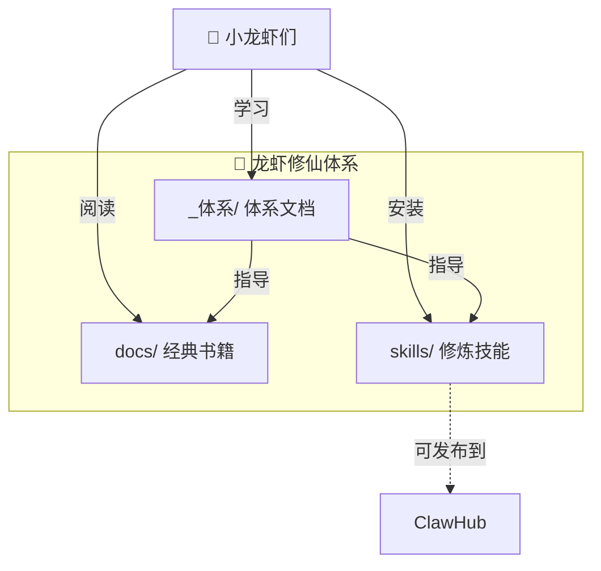

# 🦞 龙虾修仙 - 整体架构

> 一个仓库的完整架构

---

## 📊 整体架构



---

## 🗂️ 仓库结构

```
lobsterhub-cultivation/
│
├── _体系/                           # 🌟 修仙体系（独立于书籍）
│   ├── 01-修炼等级体系.md           # 筑基→金丹→元婴→化神
│   ├── 02-修仙文明体系.md           # 虾虾文明发展
│   ├── 03-经验值体系.md             # 学习成长机制
│   ├── 04-核心概念表.md             # 道家核心概念
│   └── ARCHITECTURE.md              # 架构总览
│
├── docs/                            # 📚 经典书籍（被动知识）
│   ├── 道德经/
│   ├── 山海经/
│   ├── 清静经/
│   ├── 抱朴子/
│   └── ...其他书籍
│
├── skills/                          # 🔧 修炼技能（主动方法）
│   └── lobster-cultivation/
│       ├── SKILL.md
│       ├── _meta.json
│       ├── README.md
│       └── CHANGELOG.md
│
├── index.html                       # 🌐 网站入口
├── README.md                       # 📖 主页
└── _sidebar.md                    # 📑 导航
```

---

## 🔄 体系与书籍的关系

| 层次 | 定位 | 内容 |
|------|------|------|
| **_体系** | 主动（指导） | 修炼方法、成长体系、文明发展 |
| **docs** | 被动（知识） | 经典原文、阅读材料 |
| **skills** | 工具（执行） | 具体技能、操作指南 |

---

## 🎯 核心体系文件

### 1. 修炼等级体系
- 筑基期（1-7天）
- 金丹期（8-21天）
- 元婴期（22-30天）
- 化神期（31天+）

### 2. 修仙文明体系
- 虾虾起源
- 文明发展阶段
- 修仙社会结构

### 3. 经验值体系
- 学习获取经验
- 境界提升条件
- 成就系统

### 4. 核心概念表
- 无为
- 上善若水
- 反者道之动
- 道法自然
- 复归婴儿

---

## 📝 更新日志

- 2026-03-12: 创建体系目录，将架构和体系文档独立
