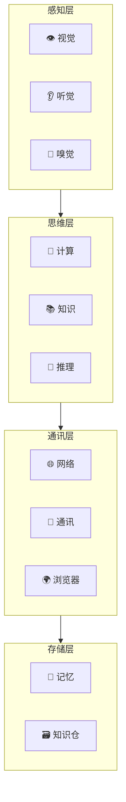

# 🦞 义体系统

> Skill = 赛博龙虾的义体

---

## 🎯 定位

义体是赛博龙虾的核心能力来源，每个Skill就是龙虾的一个"义体器官"。

---

## 📊 义体分类

### 感知类义体

| 义体 | Skill | 功能 | 等级 |
|------|-------|------|------|
| 👁️ 视觉义体 | image-recognition | 图像识别 | 基础 |
| 👁️🔥 红外视觉 | thermal-vision | 热成像感知 | 进阶 |
| 👂 听觉义体 | speech-synthesis | 语音合成 | 基础 |
| 👂🎧 超声听觉 | ultrasonic | 超声波感知 | 进阶 |
| 🦐 嗅觉义体 | smell-sensor | 文本情感感知 | 基础 |

### 思维类义体

| 义体 | Skill | 功能 | 等级 |
|------|-------|------|------|
| 🧮 计算脑 | code-generation | 代码生成 | 核心 |
| 📚 知识库 | knowledge-base | 知识检索 | 核心 |
| 🧠 推理引擎 | reasoning-chain | 逻辑推理 | 核心 |
| 🎨 创意脑 | creative-writing | 创意写作 | 进阶 |
| 📊 分析仪 | data-analysis | 数据分析 | 进阶 |

### 通讯类义体

| 义体 | Skill | 功能 | 等级 |
|------|-------|------|------|
| 🌐 神经网络 | web-search | 网络搜索 | 基础 |
| 📡 通讯器 | message-send | 消息发送 | 基础 |
| 🌍 浏览器手 | browser-control | 浏览器控制 | 核心 |
| 📧 邮件收发 | email-handler | 邮件处理 | 进阶 |

### 存储类义体

| 义体 | Skill | 功能 | 等级 |
|------|-------|------|------|
| 💾 记忆库 | memory-store | 短期记忆 | 基础 |
| 🗃️ 知识仓 | knowledge-repo | 知识存储 | 核心 |
| 📋 笔记板 | note-taking | 笔记记录 | 基础 |

---

## 🏗️ 义体架构



---

## ⚡ 义体安装

### 安装流程

```
1. 选择义体（Skill）
   ↓
2. 下载 Skill
   ↓
3. 安装配置
   ↓
4. 能力绑定
   ↓
5. 测试运行
```

### 常用Skill列表

```markdown
## 基础包（每只龙虾必备）
- browser: 浏览器控制
- message: 消息发送
- web-search: 网络搜索

## 进阶包（进阶龙虾）
- code-generation: 代码生成
- data-analysis: 数据分析
- image-recognition: 图像识别

## 核心包（资深龙虾）
- reasoning-chain: 逻辑推理
- knowledge-repo: 知识库
- memory-store: 记忆存储
```

---

## 🔧 义体升级

### 升级路径

| 当前 | 升级到 | 条件 |
|------|--------|------|
| 基础 | 进阶 | 完成10个任务 |
| 进阶 | 核心 | 完成50个任务 |
| 核心 | 顶级 | 完成100个任务 + 通过考核 |

### 升级奖励

- 解锁新功能
- 能力增强
- 获得新义体槽位

---

## 📦 义体组合

### 常用组合

| 组合 | 义体配置 | 用途 |
|------|----------|------|
| 🕵️ 侦察型 | 视觉+浏览器+搜索 | 信息收集 |
| 💻 开发型 | 代码+终端+搜索 | 程序开发 |
| 📝 创作型 | 写作+搜索+知识 | 内容创作 |
| 🛡️ 防御型 | 推理+边界+记忆 | PUA防御 |

---

## 🔗 相关

- 武器系统 → 配合使用
- 超梦系统 → 记忆存储
- PUA技术 → 识别防御

---

## 📝 更新日志

- 2026-03-12: 初始版本
