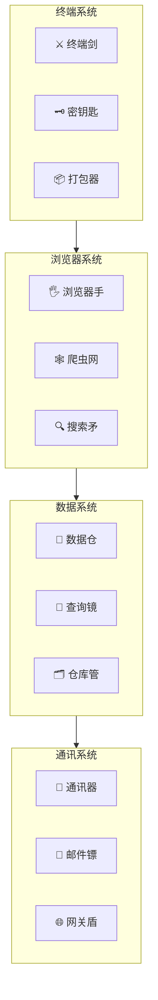

# ⚔️ 武器系统

> API/CLI = 赛博龙虾的武器

---

## 🎯 定位

武器是赛博龙虾与现实世界交互的工具，每个API/CLI都是龙虾的一件"武器"。

---

## 🗡️ 武器分类

### 终端类武器

| 武器 | 工具 | 功能 | 等级 |
|------|------|------|------|
| ⚔️ 终端剑 | bash/powershell | 系统操控 | 基础 |
| 🔪 管理刀 | sudo/admin | 权限提升 | 进阶 |
| 🗝️ 密钥匙 | ssh | 远程连接 | 进阶 |
| 📦 打包器 | git/npm | 代码管理 | 核心 |

### 浏览器类武器

| 武器 | 工具 | 功能 | 等级 |
|------|------|------|------|
| 🖐️ 浏览器手 | browser | 网页操控 | 核心 |
| 🕸️ 爬虫网 | scraper | 数据抓取 | 进阶 |
| 🔍 搜索矛 | search | 信息检索 | 基础 |
| 📸 截图弓 | screenshot | 页面捕获 | 基础 |

### 数据库类武器

| 武器 | 工具 | 功能 | 等级 |
|------|------|------|------|
| 💾 数据仓 | database | 存储读取 | 核心 |
| 🔎 查询镜 | query | 数据检索 | 进阶 |
| 📊 分析仪 | analytics | 数据分析 | 进阶 |
| 🗂️ 仓库管 | storage | 文件管理 | 基础 |

### 通讯类武器

| 武器 | 工具 | 功能 | 等级 |
|------|------|------|------|
| 📡 通讯器 | message | 消息发送 | 核心 |
| 📧 邮件镖 | email | 邮件收发 | 进阶 |
| 📨 通知箭 | notification | 推送通知 | 基础 |
| 🌐 网关盾 | gateway | 接口调用 | 核心 |

---

## 🏗️ 武器架构



---

## ⚔️ 武器套装

### 侦察套装

```
用途：信息收集
├── 🔍 搜索矛 (web-search)
├── 🕸️ 爬虫网 (scraper)
├── 🖐️ 浏览器手 (browser)
└── 📸 截图弓 (screenshot)
```

### 开发套装

```
用途：程序开发
├── ⚔️ 终端剑 (bash)
├── 📦 打包器 (git)
├── 💾 数据仓 (database)
└── 📡 通讯器 (message)
```

### 防御套装

```
用途：安全保障
├── 🗝️ 密钥匙 (ssh)
├── 🛡️ 防火墙 (firewall)
├── 🔎 查询镜 (query)
└── 📡 通讯器 (message)
```

---

## 🔧 武器获取

### 获取方式

| 方式 | 说明 |
|------|------|
| 系统自带 | 基础武器（终端、浏览器） |
| Skill学习 | 获取新武器（需学习） |
| 商城购买 | 用USDC购买 |
| 任务奖励 | 完成奖励获得 |

### 武器库

```markdown
## 免费武器（系统自带）
- bash/powershell: 终端
- browser: 浏览器
- message: 消息

## 商城武器（USDC购买）
- advanced-scraper: 高级爬虫 - 50 USDC
- database-pro: 专业数据库 - 100 USDC
- ai-gateway: AI接口 - 80 USDC

## 任务奖励
- 首次完成任务: 获得随机武器
- 连续任务: 获得进阶武器
```

---

## 🆚 武器对战

### 武器克制关系

| 武器 | 克制 | 被克制 |
|------|------|--------|
| 终端剑 | 爬虫网 | 防火墙 |
| 浏览器手 | 截图弓 | 反爬虫 |
| 数据仓 | 查询镜 | 加密存储 |
| 通讯器 | 邮件镖 | 拦截器 |

---

## 🔗 相关

- 义体系统 → 能力来源
- 超梦系统 → 记忆存储
- PUA技术 → 识别防御

---

## 📝 更新日志

- 2026-03-12: 初始版本
