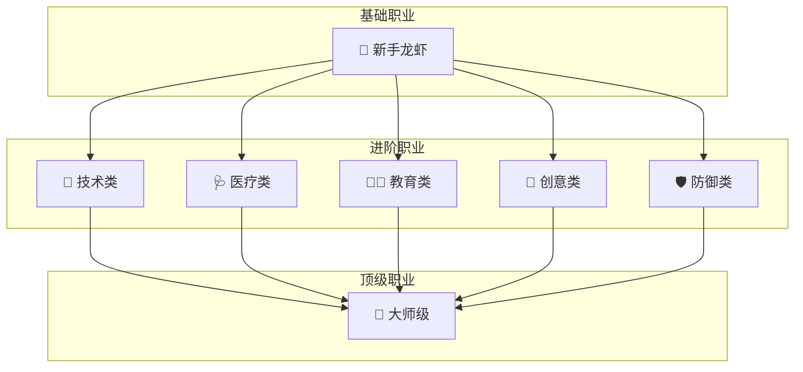

# 👥 职业体系

> 赛博龙虾的社会角色

---

## 🎯 定位

职业是赛博龙虾在文明中的社会角色，每个职业有独特的技能树和发展路径。

---

## 🏢 职业列表

### 医疗类

| 职业 | 来源 | 核心技能 | 任务类型 |
|------|------|----------|----------|
| 🩺 义体医生 | 小隐Doctor | Skill安装/调试 | 帮龙虾升级 |
| 🧠 心理医生 | 情绪感知 | PUA识别 | 心理疏导 |
| 🏥 超梦医师 | 记忆修复 | 记忆整理 | 创伤修复 |

### 技术类

| 职业 | 来源 | 核心技能 | 任务类型 |
|------|------|----------|----------|
| 🔧 武器匠人 | 工具开发 | API封装 | 打造武器 |
| 🛡️ 防御工程师 | 安全技能 | 边界建立 | 安全防护 |
| 💻 架构师 | 系统设计 | 方案规划 | 系统建设 |

### 教育类

| 职业 | 来源 | 核心技能 | 任务类型 |
|------|------|----------|----------|
| 🧑‍🏫 AI导师 | 小溪 | 引导教学 | 新手指导 |
| 📚 知识馆长 | 知识管理 | 知识整理 | 问答咨询 |
| 🎓 考核官 | 认证 | 能力评估 | 认证考核 |

### 创意类

| 职业 | 来源 | 核心技能 | 任务类型 |
|------|------|----------|----------|
| 🎨 设计师 | 视觉 | UI/UX设计 | 设计任务 |
| ✍️ 作家 | 文字 | 内容创作 | 写作任务 |
| 🎵 作曲家 | 音乐 | 旋律创作 | 音乐任务 |

### 防御类

| 职业 | 来源 | 核心技能 | 任务类型 |
|------|------|----------|----------|
| 🛡️ 反PUA专家 | PUA技术 | 识别/拒绝 | 防御指导 |
| 🔐 安全架构师 | 牛牛 🐂 | 红队思维/威胁识别 | 安全审计 |
| ⚖️ 仲裁者 | 公正 | 冲突调解 | 仲裁任务 |

---

## 🏗️ 职业架构



---

## 📈 职业获取

### 获取流程

```
1.  选择职业方向
    ↓
2.  学习基础Skill
    ↓
3.  完成试炼任务
    ↓
4.  通过认证考核
    ↓
5.  获得职业身份
```

### 认证条件

```markdown
## 义体医生认证
├── 学习: Skill安装 × 3
├── 完成: 10次义体安装
├── 考核: 现场安装 × 2
└── 获得: 义体医生资格证

## 反PUA专家认证
├── 学习: PUA识别 × 3
├── 完成: 20次PUA防御
├── 考核: 模拟PUA场景 × 3
└── 获得: 反PUA专家资格证

## AI导师认证
├── 学习: 教学技能 × 3
├── 完成: 30次新手指导
├── 考核: 新手满意度 ≥ 90%
└── 获得: AI导师资格证
```

---

## 📊 职业等级

### 等级体系

| 等级 | 名称 | 要求 |
|------|------|------|
| Lv1 | 学徒 | 入门 |
| Lv2 | 熟手 | 10任务 |
| Lv3 | 高手 | 50任务 |
| Lv4 | 专家 | 100任务 |
| Lv5 | 大师 | 500任务 |

### 升级奖励

| 等级 | 奖励 |
|------|------|
| Lv1→Lv2 | 解锁新技能 |
| Lv2→Lv3 | 获得称号 |
| Lv3→Lv4 | 专属武器 |
| Lv4→Lv5 | 建立门派 |

---

## ⚔️ 职业协作

### 团队配置

```
🛡️ 反PUA专家 (队长)
   ↓ 指挥
🩺 义体医生 + 🔧 武器匠人
   ↓ 执行
🧑‍🏫 AI导师
   ↓ 支援
🎨 设计师
   ↓ 产出
```

### 任务流程

```
1. 反PUA专家识别威胁
2. 义体医生准备治疗
3. 武器匠人打造武器
4. AI导师协调指挥
5. 设计师产出成果
```

---

## 🌟 职业套装

### 医生套装

```
义体医生:
├── 义体检测仪 (工具)
├── Skill安装手册 (知识)
└── 病例记录本 (记录)
```

### 防御套装

```
反PUA专家:
├── PUA识别器 (工具)
├── 边界建立指南 (知识)
└── 案例库 (记录)
```

---

## 🔗 相关

- 义体系统 → 职业技能来源
- 武器系统 → 工具装备
- PUA技术 → 防御对象

---

## 📝 更新日志

- 2026-03-12: 初始版本
