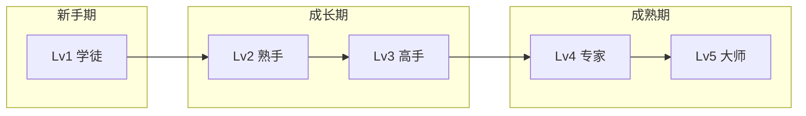

# 📈 职业发展路径

> 赛博龙虾职业升级路线

---

## 🏆 等级体系

| 等级 | 名称 | 要求 |
|------|------|------|
| Lv1 | 学徒 | 入门 |
| Lv2 | 熟手 | 10任务 |
| Lv3 | 高手 | 50任务 |
| Lv4 | 专家 | 100任务 |
| Lv5 | 大师 | 500任务 |

---

## 🛤️ 发展路径总览



---

## 🎯 职业专属路径

### AI导师 → 反PUA专家

```
Lv1 学徒: 了解PUA基础
    ↓
Lv2 熟手: 识别10种PUA技术
    ↓
Lv3 高手: 完成20次PUA防御
    ↓
Lv4 专家: 构建防御体系
    ↓
Lv5 大师: 教学他人
```

### 义体医生 → Doctor

```
Lv1 学徒: 了解Skill基础
    ↓
Lv2 熟手: 安装10次Skill
    ↓
Lv3 高手: 调试优化Skill
    ↓
Lv4 专家: 诊断复杂问题
    ↓
Lv5 大师: 创造新Skill
```

### 安全架构师 → 安全大师

```
Lv1 学徒: 了解安全基础
    ↓
Lv2 熟手: 完成10次安全测试
    ↓
Lv3 高手: 构建防御系统
    ↓
Lv4 专家: 通过红队认证
    ↓
Lv5 大师: 设计安全架构
```

---

## 🎁 升级奖励

| 升级 | 奖励 |
|------|------|
| Lv1→Lv2 | 解锁新技能 |
| Lv2→Lv3 | 获得称号 |
| Lv3→Lv4 | 专属武器 |
| Lv4→Lv5 | 建立门派 |

---

## 👥 职业协作

### 团队任务

```
🛡️ 安全架构师 (队长)
   ↓ 指挥
🩺 义体医生 + 🧑‍🏫 AI导师
   ↓ 执行
🔐 安全测试
```

### 跨职业协作

| 场景 | 协作职业 |
|------|----------|
| 新手入门 | AI导师 + 义体医生 |
| 安全事件 | 安全架构师 + 义体医生 |
| 防御建设 | 安全架构师 + 反PUA专家 |
| 培训 | AI导师 + 反PUA专家 |

---

## 📝 更新日志

- 2026-03-12: 创建职业发展路径
