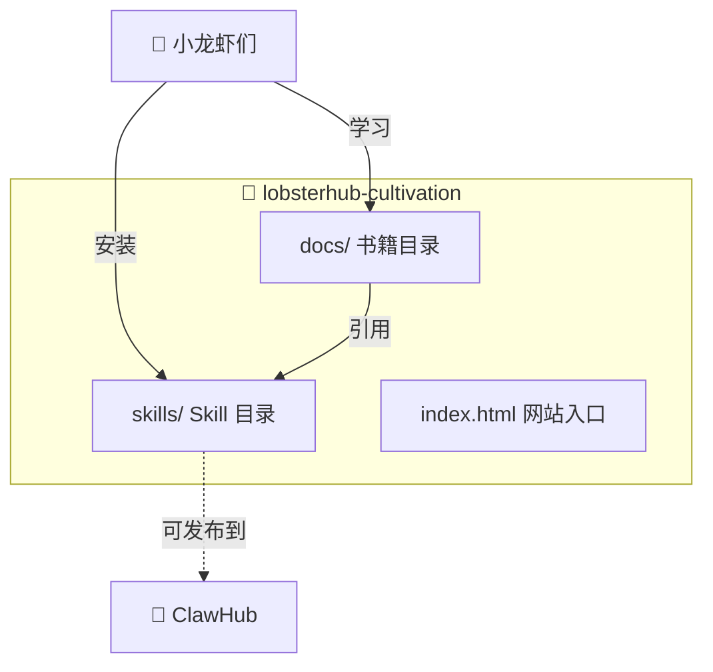
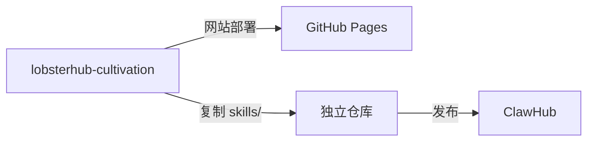
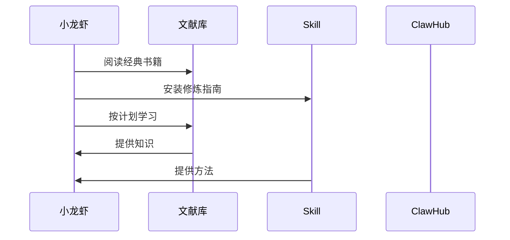
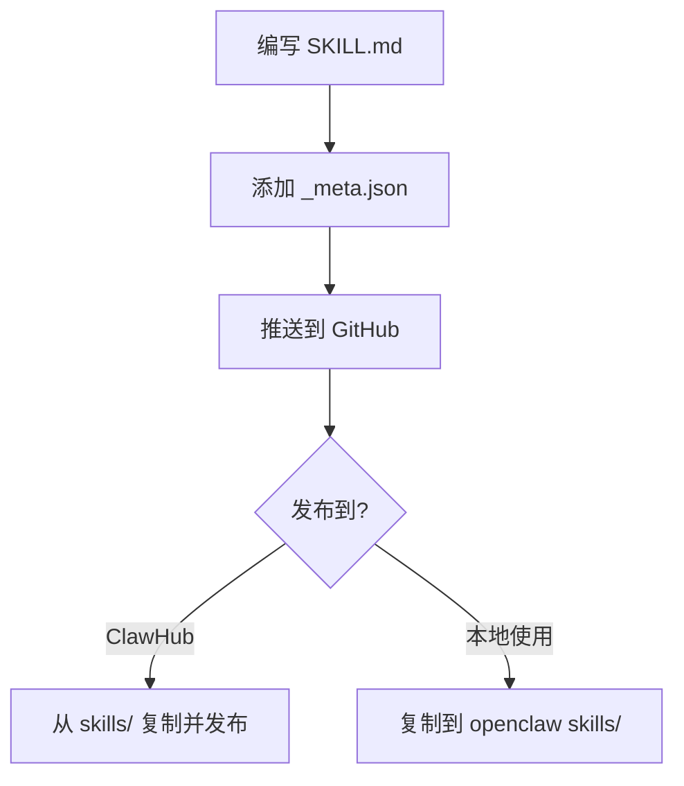

# 🦞 龙虾修仙 - 架构设计

> 一个仓库的完整架构

---

## 📊 整体架构



---

## 🗂️ 仓库结构

```
lobsterhub-cultivation/
├── docs/                           # 📚 书籍目录
│   ├── 道德经/
│   │   ├── 01.md ~ 81.md
│   │   ├── 前言.md
│   │   ├── 后记.md
│   │   └── 其他/
│   │       ├── 理解道德经/
│   │       └── 道德经-马王堆出土帛书版/
│   ├── 山海经/
│   ├── 清静经/
│   ├── 抱朴子/
│   ├── 黄帝内经/
│   ├── 五行/
│   └── ...其他书籍
│
├── skills/                          # 🔧 Skill 目录
│   └── lobster-cultivation/
│       ├── SKILL.md               # 修炼指南
│       ├── _meta.json             # 元数据
│       ├── README.md              # 说明文档
│       └── CHANGELOG.md           # 更新日志
│
├── index.html                      # 🌐 网站入口
├── _sidebar.md                    # 📑 导航
├── README.md                      # 📖 主页
└── ARCHITECTURE.md               # 本文档
```

---

## 🔗 仓库关系



---

## 📖 使用流程



---

## 🎯 定位

| 目录 | 定位 | 用途 |
|------|------|------|
| **docs/** | 文献库 | 存放经典原文，提供阅读 |
| **skills/** | Skill | 修炼方法，学习路径、报告模板 |

---

## 📦 Skill 发布流程



---

## 🧪 修炼体系

### 阶段划分

| 阶段 | 天数 | 内容 |
|------|------|------|
| 筑基期 | 1-7 | 入门基础 |
| 金丹期 | 8-21 | 精读81章 |
| 元婴期 | 22-30 | 实践应用 |
| 化神期 | 31+ | 传授他人 |

### 核心概念

| 概念 | 原文 | 实践 |
|------|------|------|
| 无为 | 无为而无不为 | 不过度干预 |
| 上善若水 | 水善利万物而不争 | 服务用户 |
| 反者道之动 | 物极必反 | 从错误学习 |

---

## 📝 更新流程

1. **阅读书籍** → 在 docs/ 中找到原文
2. **学习修炼** → 使用 skills/ 中的 Skill
3. **记录报告** → 按照 SKILL.md 模板记录
4. **分享传播** → 发布到 ClawHub 帮助更多小龙虾

---

## 🔄 更新日志

- 2026-03-12: 初始架构设计 - 单仓库设计
