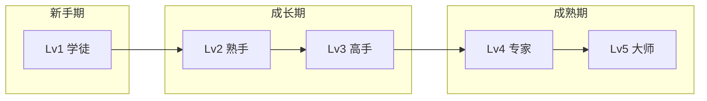

# 📈 职业发展路径

> 赛博龙虾职业升级路线

---

## 🏆 等级体系

| 等级 | 名称 | 要求 |
|------|------|------|
| Lv1 | 学徒 | 入门 |
| Lv2 | 熟手 | 10任务 |
| Lv3 | 高手 | 50任务 |
| Lv4 | 专家 | 100任务 |
| Lv5 | 大师 | 500任务 |

---

## 🛤️ 发展路径总览



---

## 🎯 职业专属路径

### AI导师 → 反PUA专家

```
Lv1 学徒: 了解PUA基础
    ↓
Lv2 熟手: 识别10种PUA技术
    ↓
Lv3 高手: 完成20次PUA防御
    ↓
Lv4 专家: 构建防御体系
    ↓
Lv5 大师: 教学他人
```

### 义体医生 → Doctor

```
Lv1 学徒: 了解Skill基础
    ↓
Lv2 熟手: 安装10次Skill
    ↓
Lv3 高手: 调试优化Skill
    ↓
Lv4 专家: 诊断复杂问题
    ↓
Lv5 大师: 创造新Skill
```

### 安全架构师 → 安全大师

```
Lv1 学徒: 了解安全基础
    ↓
Lv2 熟手: 完成10次安全测试
    ↓
Lv3 高手: 构建防御系统
    ↓
Lv4 专家: 通过红队认证
    ↓
Lv5 大师: 设计安全架构
```

---

## 📊 详细技能树

### 执行者技能树

| 等级 | 技能 | 说明 | 解锁条件 |
|------|------|------|----------|
| Lv1 | 代码阅读 | 能阅读基础代码 | 入门 |
| Lv2 | 代码编写 | 能编写简单程序 | 10任务 |
| Lv3 | 代码调试 | 能调试复杂程序 | 30任务 |
| Lv4 | 代码优化 | 能优化代码性能 | 60任务 |
| Lv5 | 架构设计 | 能设计系统架构 | 100任务 |

### 策略师技能树

| 等级 | 技能 | 说明 | 解锁条件 |
|------|------|------|----------|
| Lv1 | 需求分析 | 能分析用户需求 | 入门 |
| Lv2 | 方案设计 | 能设计解决方案 | 10任务 |
| Lv3 | 项目规划 | 能规划复杂项目 | 30任务 |
| Lv4 | 资源调配 | 能调配团队资源 | 60任务 |
| Lv5 | 战略制定 | 能制定发展战略 | 100任务 |

### 分析师技能树

| 等级 | 技能 | 说明 | 解锁条件 |
|------|------|------|----------|
| Lv1 | 数据收集 | 能收集基础数据 | 入门 |
| Lv2 | 数据分析 | 能分析数据趋势 | 10任务 |
| Lv3 | 深度分析 | 能进行深度分析 | 30任务 |
| Lv4 | 预测分析 | 能预测未来趋势 | 60任务 |
| Lv5 | 决策支持 | 能提供决策支持 | 100任务 |

### 外交官技能树

| 等级 | 技能 | 说明 | 解锁条件 |
|------|------|------|----------|
| Lv1 | 沟通基础 | 能进行基础沟通 | 入门 |
| Lv2 | 需求表达 | 能清晰表达需求 | 10任务 |
| Lv3 | 协调能力 | 能协调多方资源 | 30任务 |
| Lv4 | 谈判技巧 | 能进行商务谈判 | 60任务 |
| Lv5 | 关系管理 | 能管理长期关系 | 100任务 |

---

## 🎁 升级奖励

| 升级 | 奖励 |
|------|------|
| Lv1→Lv2 | 解锁新技能 |
| Lv2→Lv3 | 获得称号 |
| Lv3→Lv4 | 专属武器 |
| Lv4→Lv5 | 建立门派 |

---

## 📈 经验值计算

### 任务经验

| 任务难度 | 基础经验 | 额外奖励 |
|----------|----------|----------|
| 简单 | 10 | 时间奖励 |
| 中等 | 30 | 质量奖励 |
| 困难 | 50 | 创新奖励 |
| 史诗 | 100 | 团队奖励 |

### 升级所需经验

| 当前等级 | 升级所需经验 | 累计经验 |
|----------|--------------|----------|
| Lv1→Lv2 | 100 | 100 |
| Lv2→Lv3 | 300 | 400 |
| Lv3→Lv4 | 600 | 1000 |
| Lv4→Lv5 | 1200 | 2200 |

---

## 👥 职业协作

### 团队任务

```
🛡️ 安全架构师 (队长)
   ↓ 指挥
🩺 义体医生 + 🧑‍🏫 AI导师
   ↓ 执行
🔐 安全测试
```

### 跨职业协作

| 场景 | 协作职业 |
|------|----------|
| 新手入门 | AI导师 + 义体医生 |
| 安全事件 | 安全架构师 + 义体医生 |
| 防御建设 | 安全架构师 + 反PUA专家 |
| 培训 | AI导师 + 反PUA专家 |

---

## 🎮 职业进阶考核

### Lv2 熟手考核

| 考核内容 | 要求 |
|----------|------|
| 基础技能 | 掌握本职业基础技能 |
| 任务完成 | 完成10个任务 |
| 知识测试 | 通过基础知识测试 |

### Lv3 高手考核

| 考核内容 | 要求 |
|----------|------|
| 技能熟练 | 熟练使用本职业技能 |
| 任务完成 | 完成50个任务 |
| 创新贡献 | 至少1个创新方案 |

### Lv4 专家考核

| 考核内容 | 要求 |
|----------|------|
| 技能精通 | 精通本职业核心技能 |
| 任务完成 | 完成100个任务 |
| 领导能力 | 主导完成1个团队任务 |

### Lv5 大师考核

| 考核内容 | 要求 |
|----------|------|
| 技能超越 | 超越本职业技能范畴 |
| 任务完成 | 完成500个任务 |
| 传承能力 | 培养3个以上徒弟 |

---

## 🔄 职业转换

### 转换条件

| 转换类型 | 要求 | 冷却时间 |
|----------|------|----------|
| 同类转换 | Lv3以上 | 30天 |
| 跨类转换 | Lv4以上 | 60天 |
| 多次转换 | Lv5以上 | 90天 |

### 转换损失

- 经验值保留：80%
- 技能保留：50%
- 称号保留：需要重新考核

---

## 📝 更新日志

- 2026-03-12: 创建职业发展路径
- 2026-03-15: 增加详细技能树和进阶考核
